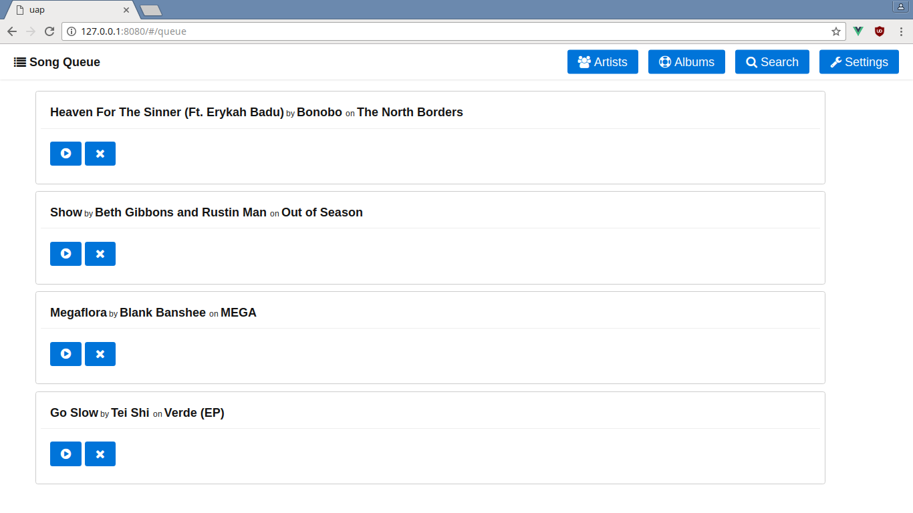

# uap
an audio webserver for streaming music / using as a jukebox

# preview


# about
uap (Untitled Audio Project) is a portable cross platform 
web server for streaming audio from a single computer
to any other computer over the web. It was inspired by 
projects like [Zeya](http://web.psung.name/zeya/) and
[Ampache](http://ampache.org/)

# features
* MP3 / Flac / Ogg support
* Cross platform (Linux / Windows / OSX)
* Searching support
* Queue support
* Responsive UI on mobile
* Low ram usage for server (~30MB).
* Support for user accounts. 
   * Open signups
   * Closed signups
   * Public mode (no accounts required)
* Clean hackable code base.
   * Unittests 
   * Mock modules

# installation guide

1. Install [Python3](https://www.python.org/download/releases/3.0/) 
   because it's 20xx and nobody should be using Python2, don't
   untick the pip package manager because we'll need it.
2. Clone or download and extract the repo as a zip into a folder that
   you want to keep the application saved in. Remember where you're
   storing it for later.
3. Navigate to the ````uap```` folder and execute the command 
   ```pip install -r requirements.txt``` to install the dependencies 
   for the app ```(bottle, beaker, mutagen, bcrypt, tinydb)```
4. Inside of the root ``uap`` folder execute the command ``python -m src.uap``
   to generate a ``config.ini`` file in the root directory.
5. Edit this file to your liking (see the comments inside for
   explanations of what each setting does)
6. Rerun ``python -m src.uap`` to launch the server
7. After it finishes loading your music library connect to the
   address printed in the console in any web browser and enjoy!
